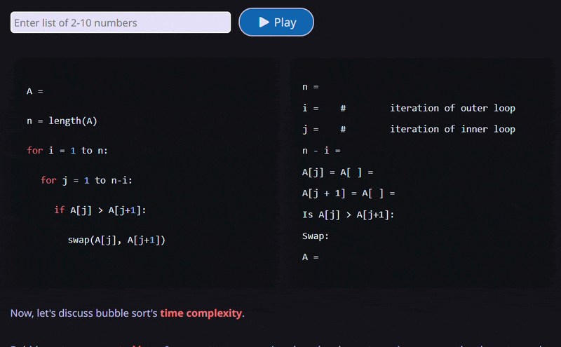
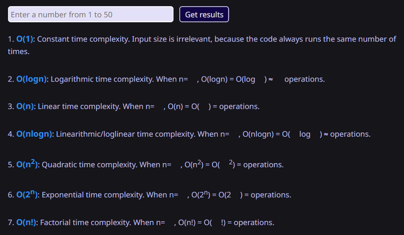
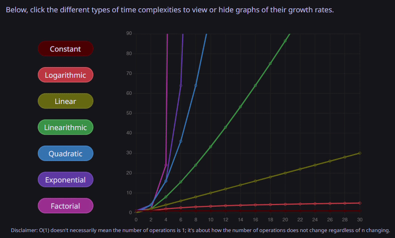
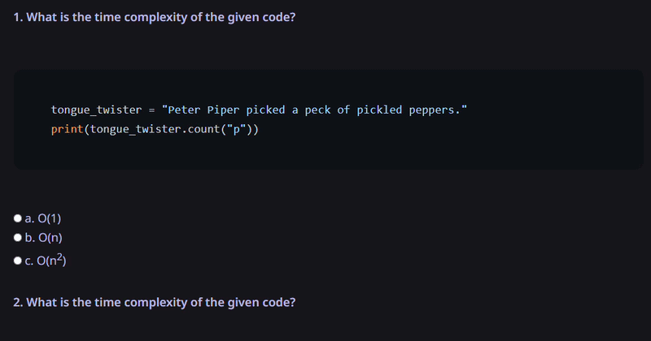

# Code Prep School

**[View Live Demo](https://kendomi0.github.io/code-prep-school/)**

This website teaches coding fundamentals, such as time complexity and algorithms, with code snippets and interactive elements, including time complexity visualization, step-by-step animations of algorithms, and quizzes with feedback.

My intention with this website is to describe programming concepts in accessible terms. I noticed that some coding resources are written in ways that may be difficult to understand for aspiring learners with limited programming experience, and thus was inspired to build a website with a simplified pedagogical approach.

## Technologies Used

- HTML: Structure
- CSS: Visual styling
- JavaScript: Interactivity
- Vite: Bundles code and dependencies

### Dev Tooling
- ESLint: Enforces code quality and consistency
- Prettier: Automatic code formatting

## Concepts Covered
- Time complexity
    - Basics and importance of time complexity
    - Time complexity of built-in methods
    - Time complexity types: constant, linear, quadratic
    - Big O-notation
- Algorithms
    - What an algorithm is, how it works, what they're used for
    - Insertion sort
    - Bubble sort

## Interactive Features
- Step-by-step bubble sort animation



- Big-O time complexity calculations



- Big-O growth graph



- Time complexity quiz with feedback



## Future Additions
- Insertion sort animation
- Conceptual breakdowns and animations for additional algorithms: merge sort, binary search
- Important programming practices: refactoring, debugging, and version control

## Run Locally
```
npm install
npm run dev
```
